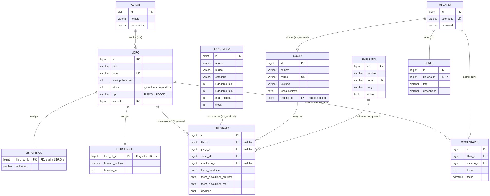

# Biblioteca Horizonte

Aplicación web en **Django (patrón MVT)** para una biblioteca que **presta** libros (físicos y digitales) y juegos de mesa a sus socios. Usa **MariaDB** como base de datos, autenticación nativa de Django (todo el sitio exige sesión) y validación de formularios con JavaScript.

## Dominio, entidades y relaciones

| Entidad | Descripción |
|---|---|
| `Autor` | Autor de los libros (nombre y nacionalidad). |
| `Libro` | **Súper tipo**: título, ISBN, año, autor y ejemplares disponibles, comunes a todo libro. |
| `LibroFisico` | **Subtipo** de `Libro` (herencia de tablas de Django): agrega la ubicación en la estantería. |
| `LibroEbook` | **Subtipo** de `Libro`: agrega formato de archivo (EPUB/PDF/MOBI) y tamaño en MB. |
| `JuegoMesa` | Tabla independiente (no es un libro): nombre, marca, categoría, rango de jugadores, edad mínima y ejemplares disponibles. |
| `Socio` | Miembro de la biblioteca que pide préstamos. |
| `Empleado` | Personal de la biblioteca (bibliotecario, asistente, administrador). |
| `Prestamo` | Un libro **o** un juego de mesa prestado a un socio, opcionalmente atendido por un empleado. |
| `Perfil` | Foto y descripción de cada cuenta de usuario (`auth.User`). Se crea sola al crear la cuenta. |
| `Comentario` | Una opinión de un usuario sobre un libro: el foro del catálogo. |

Relaciones: `Autor 1—N Libro`, `Libro 1—N Prestamo` (opcional), `JuegoMesa 1—N Prestamo` (opcional), `Socio 1—N Prestamo`, `Empleado 1—N Prestamo` (opcional), `Socio 1—1 User` (opcional), `User 1—1 Perfil`, `Libro 1—N Comentario`, `User 1—N Comentario`. `LibroFisico` y `LibroEbook` heredan de `Libro`.



Diagrama fuente (editable) y detalle de cardinalidades en [docs/modelo.md](docs/modelo.md).

### Por qué `Libro` es un súper tipo con subtipos

Un libro físico y un ebook comparten título, autor, ISBN, año y ejemplares disponibles, pero cada uno necesita datos distintos (ubicación en la estantería vs. formato de archivo). En vez de repetir los campos comunes en dos modelos separados, `Libro` los declara una sola vez y `LibroFisico`/`LibroEbook` heredan de él mediante **herencia de tablas de Django**: cada subtipo tiene su propia tabla, unida a `Libro` por la misma clave primaria. Un campo `tipo` indica cuál es cuál.

### Justificación de cada `on_delete`

- **`Libro.autor` → `PROTECT`**: no se puede borrar un autor que tiene libros; evita dejar libros huérfanos.
- **`Prestamo.libro` → `PROTECT`**: el préstamo es un registro histórico, el libro prestado debe seguir existiendo.
- **`Prestamo.juego` → `PROTECT`**: mismo motivo, aplicado a los juegos de mesa.
- **`Prestamo.socio` → `CASCADE`**: si un socio deja de ser miembro y se elimina, su historial de préstamos se elimina con él.
- **`Prestamo.empleado` → `PROTECT`**: cuando un bibliotecario atiende el préstamo, debe quedar registrado quién fue; para retirarlo se desmarca `activo`, no se elimina.
- **`Socio.usuario` → `SET_NULL`**: si se borra la cuenta de acceso de un socio, su ficha (y su historial de préstamos) se conserva; solo queda sin acceso web.
- **`Perfil.usuario` → `CASCADE`**: el perfil no tiene sentido sin la cuenta a la que pertenece; si se borra la cuenta, se borra su perfil.
- **`Comentario.libro` → `CASCADE`**: si se elimina un libro (sin préstamos, ya que `Prestamo.libro` lo protege), sus opiniones dejan de tener sentido y se eliminan con él.
- **`Comentario.usuario` → `CASCADE`**: si se elimina una cuenta, sus opiniones se van con ella.

## Arquitectura MVT

- **Modelo** (`biblioteca/models.py`): datos y reglas de negocio (plazos, atraso, devolución). `Prestable` es una clase abstracta que factoriza los ejemplares disponibles para `Libro` y `JuegoMesa`.
- **Vistas** (`biblioteca/views.py`): delgadas; reciben la petición, usan formularios/modelos y devuelven la plantilla. Todas exigen sesión (`@login_required`).
- **Plantillas** (`biblioteca/templates/biblioteca/`): heredan de `base.html`; sin consultas a la BD.
- **Estáticos** (`biblioteca/static/biblioteca/`): `css/styles.css` y `js/validation.js`.
- `biblioteca_project/urls.py` delega en `biblioteca/urls.py` con `include()`.

## Autenticación y permisos diferenciados

Todo el sitio exige inicio de sesión (R3 del taller): al entrar sin sesión, o al escribir cualquier URL directamente, se redirige al login. El menú muestra el usuario conectado y el botón de cerrar sesión.

Además, hay dos niveles de acceso, usando el campo `is_staff` que ya trae `django.contrib.auth` (sin inventar un campo de "rol" propio):

| | Socio (`lector`) | Administrador (`admin`, `is_staff=True`) |
|---|---|---|
| Ver el catálogo de libros y juegos | Sí | Sí |
| Disponibilidad de un libro/juego | Solo "Disponible" / "No disponible" | Cantidad exacta de ejemplares |
| Quién tiene un ejemplar prestado | No lo ve | Ve el nombre del socio ("Prestado a: …") |
| Pedir un préstamo para sí mismo ("Mi lista") | Sí | Sí |
| Crear/editar/eliminar libros, juegos y socios | No (redirige a inicio) | Sí |
| Ver el listado de socios y sus datos de contacto | No | Sí |
| Registrar un préstamo en el mesón o marcarlo como devuelto | No | Sí |
| Ver sus propios préstamos y su fecha límite de devolución ("Mis préstamos") | Sí (solo lectura) | Sí (solo lectura) |

La vista `libro_list`/`juego_list` solo trae qué socio tiene cada ejemplar prestado (`Prefetch` con los préstamos sin devolver) cuando quien mira es administrador, para no hacer esa consulta de más cuando nadie la va a usar. Las vistas de gestión usan un decorador propio, `solo_administradores` (en `views.py`), que envuelve a `@login_required` y además exige `request.user.is_staff`; si no se cumple, redirige a inicio con un aviso.

"Mis préstamos" es de solo lectura a propósito, incluso para el administrador: marcar una devolución sigue siendo una acción del mesón (`/prestamos/`), no algo que la propia cuenta haga sobre sí misma.

### Cómo se vincula una cuenta con un socio

`Socio.usuario` es un `OneToOneField` opcional hacia `auth.User`. Cuando existe ese vínculo:

- **"Mi lista de préstamos"** ya no pide elegir un socio de una lista: usa automáticamente `request.user.socio`, así nadie puede pedir préstamos a nombre de otra persona.
- **"Mis préstamos"** (`/mis-prestamos/`) muestra los préstamos activos de ese socio y su fecha límite.

El registro manual en el mesón (`/prestamos/nuevo/`) es aparte y sigue pidiendo el socio explícitamente, porque ahí es el bibliotecario quien atiende a alguien que tiene enfrente, vinculado o no a una cuenta.

## Base de datos: MariaDB

Script para crear la base y el usuario (ejecutar como administrador de MariaDB):

```sql
CREATE DATABASE biblioteca_db CHARACTER SET utf8mb4 COLLATE utf8mb4_unicode_ci;
CREATE USER 'biblioteca_user'@'%' IDENTIFIED BY 'cambia-esta-clave';
GRANT ALL PRIVILEGES ON biblioteca_db.* TO 'biblioteca_user'@'%';
FLUSH PRIVILEGES;
```

Las credenciales se leen desde variables de entorno (archivo `.env`, excluido del repositorio). Los nombres están en `.env.example`.

## Instalación

### Opción A: Docker (recomendada)

Levanta MariaDB, aplica migraciones, carga datos de demostración y arranca Django.

1. Copiar la configuración y editar las claves:

   ```powershell
   Copy-Item .env.example .env
   ```

2. Ejecutar:

   ```powershell
   docker compose up --build
   ```

3. Abrir <http://localhost:8000/> (redirige al login).

Para detener: `docker compose down`. Para borrar también los datos: `docker compose down -v`.

### Opción B: instalación manual

Requiere Python 3.11+ y MariaDB 10.5+.

1. Crear la base y el usuario con el script SQL de arriba.
2. Crear el entorno virtual e instalar dependencias:

   ```powershell
   python -m venv .venv
   .venv\Scripts\Activate.ps1
   pip install -r requirements.txt
   ```

3. `Copy-Item .env.example .env` y completar `DB_HOST`, `DB_PORT`, `DB_NAME`, `DB_USER`, `DB_PASSWORD`.
4. Aplicar migraciones y cargar datos:

   ```powershell
   python manage.py migrate
   python manage.py seed_demo
   python manage.py runserver
   ```

5. Abrir <http://127.0.0.1:8000/>. Sin sesión se redirige al login.

## Usuarios de prueba

Los crea el comando `seed_demo`:

| Rol | Usuario | Contraseña |
|---|---|---|
| Superusuario (accede a `/admin/`) | `admin` | `Admin12345!` |
| Usuario común, sin socio vinculado | `lector` | `Lector12345!` |
| Socio: Sofía Martínez | `sofia-martinez` | `S12345678` |
| Socio: Mateo González | `mateo-gonzalez` | `M12345678` |
| Socio: Valentina Rojas | `valentina-rojas` | `V12345678` |
| Socio: Diego Fuentes | `diego-fuentes` | `D12345678` |
| Socio: Camila Torres | `camila-torres` | `C12345678` |

Las cuentas de socio se generan con una contraseña genérica (inicial del nombre + `12345678`), pensada para que la cambien en su primer ingreso. Son solo para desarrollo local. `lector` se dejó deliberadamente sin vincular a ningún socio, para poder mostrar también ese estado ("tu cuenta no está vinculada a un socio") en `/mis-prestamos/` y `/mi-lista/`.

## Funcionalidades

- Login y logout propios (autenticación de `django.contrib.auth`); **todas** las vistas exigen sesión.
- CRUD completo de **libros**, con dos formularios distintos según el formato (físico / ebook), listado filtrable por autor y por formato, con desplegables poblados desde la BD.
- CRUD completo de **juegos de mesa**.
- **Préstamos**: registro en mesón (con empleado obligatorio) o desde "Mi lista de préstamos", una lista temporal en sesión donde el propio socio junta varios títulos y los confirma de una vez (quedan sin empleado asociado, y el socio se toma automáticamente de la cuenta vinculada). Un préstamo es de un libro *o* de un juego (regla validada en cliente y servidor). Control de ejemplares disponibles, fecha de devolución según el tipo de producto, aviso de atraso y botón para marcar como devuelto (el historial no se borra).
- **Mis préstamos** (`/mis-prestamos/`): cualquier cuenta vinculada a un socio ve, de solo lectura, qué tiene prestado y su fecha límite de devolución.
- **Perfil de usuario** (`/perfil/`): cada cuenta puede subir su foto y escribir una descripción corta. Se crea automáticamente al crear la cuenta (señal `post_save` sobre `auth.User`, ver `signals.py`), y su foto aparece en el encabezado del sitio.
- **Foro de opiniones**: cada libro tiene su propia página (`/libros/<id>/`) con las opiniones de los lectores y un formulario para agregar la propia.
- **Socios**: listado y registro (solo administrador).
- **Portadas**: libros y juegos aceptan una imagen de portada, subida desde su formulario o desde `/admin/`. Sin imagen, se muestra un ícono de reemplazo.
  - Las portadas que vienen con los datos de ejemplo viajan en el repositorio, como cualquier otro archivo estático: `biblioteca/static/biblioteca/img/semillas/`. El comando `seed_demo` las copia automáticamente al campo `imagen` de cada libro/juego la primera vez que se cargan los datos (`asignar_imagen_semilla()` en `seed_demo.py`), así que no hace falta entregar ni descomprimir nada aparte para que se vean.
  - Cualquier portada que se suba *después* (desde el formulario o el admin) sigue guardándose en `mediafiles/` (excluido del repositorio; en Docker vive en un volumen aparte, `media_data`, para no perderse al reconstruir la imagen). Esa es la diferencia entre `static/` (lo que trae el desarrollador, versionado) y `media/` (lo que sube cada instalación, no versionado).
- Fondo decorativo: un video en bucle (`static/biblioteca/video/bookshop-fondo.mp4`), oscurecido y teñido de verde, que solo se asoma como marco angosto a los costados del contenido (el centro, donde está el texto, se mantiene sobre el color de página normal para no perder legibilidad). Se oculta en pantallas angostas y si el sistema tiene activado "reducir movimiento".
- Estados de vista en los listados: con datos, vacío, cargando y error (`/libros/?tipo=xxx`).
- Validación en cliente (`validation.js`): campo obligatorio, largo mínimo, formato de correo, formato de teléfono, rango numérico, selección obligatoria y selección exclusiva entre dos campos (libro/juego). El servidor valida de nuevo en los modelos.
- Panel `/admin/` con los 9 modelos personalizados.

## Respaldo de la base de datos

El respaldo con los datos de prueba está en [respaldo_biblioteca.sql](respaldo_biblioteca.sql). Para restaurarlo:

```powershell
mariadb -u biblioteca_user -p biblioteca_db < respaldo_biblioteca.sql
```

Para regenerarlo con Docker:

```powershell
docker compose exec -T db sh -c 'mariadb-dump -u"$MARIADB_USER" -p"$MARIADB_PASSWORD" --result-file=/tmp/respaldo.sql "$MARIADB_DATABASE"'
docker compose cp db:/tmp/respaldo.sql respaldo_biblioteca.sql
```
