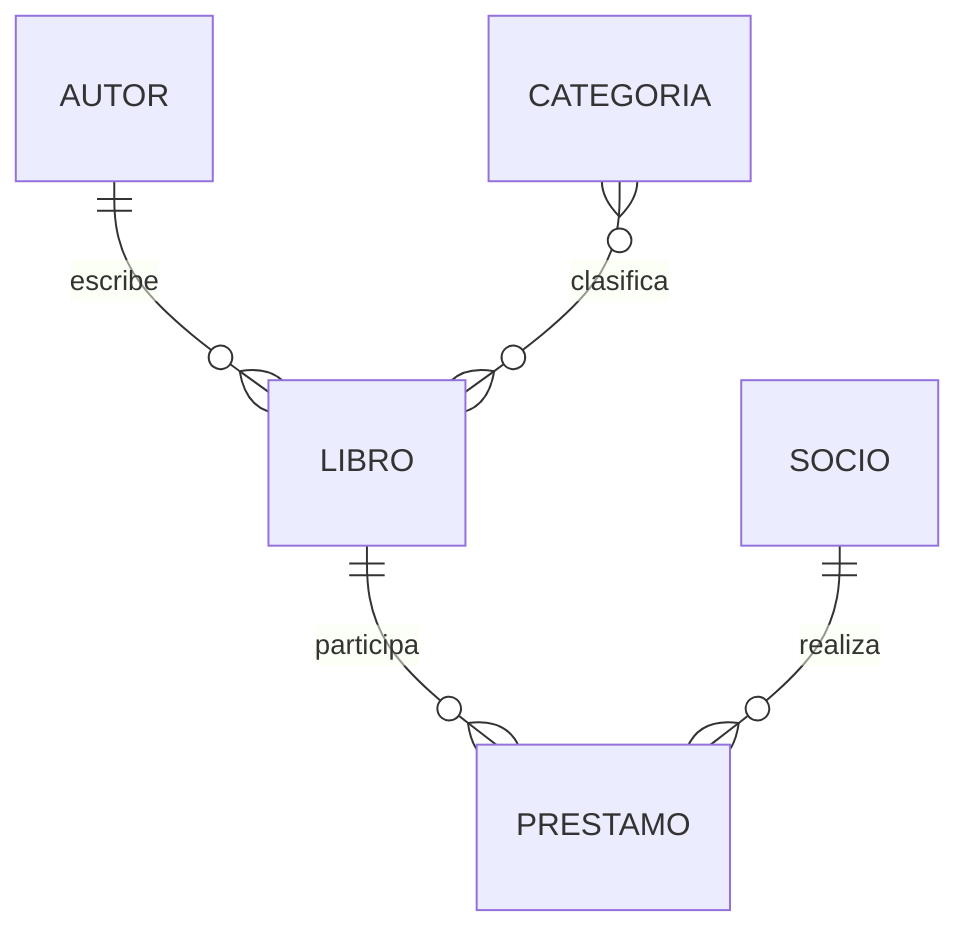

# Modelo de datos

Entidades: `Autor`, `Categoria`, `Libro`, `Socio` y `Prestamo`.

- `Libro.autor` usa `PROTECT`: no se puede eliminar un autor que tiene libros asociados.
- `Prestamo.libro` usa `PROTECT`: se conserva el historial de prestamos y no se elimina un libro prestado.
- `Prestamo.socio` usa `CASCADE`: al eliminar un socio se eliminan sus prestamos dependientes.
- `Libro.categorias` es una relacion `ManyToManyField` porque un libro puede pertenecer a varias categorias.
